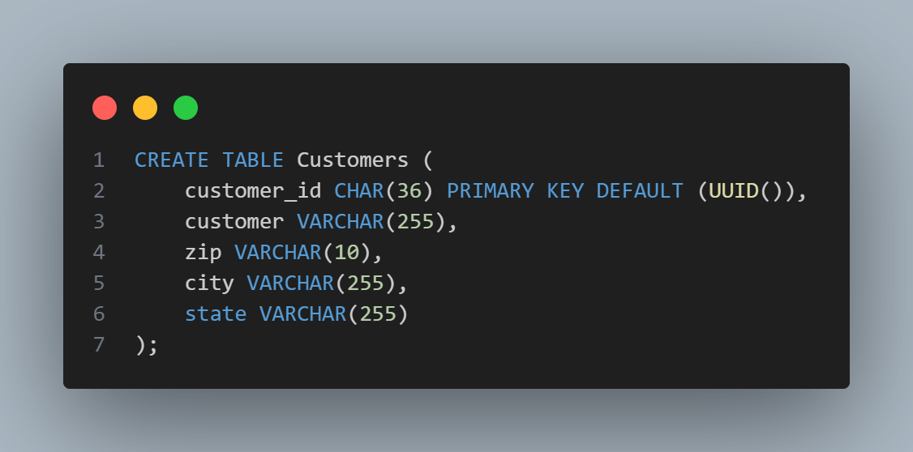
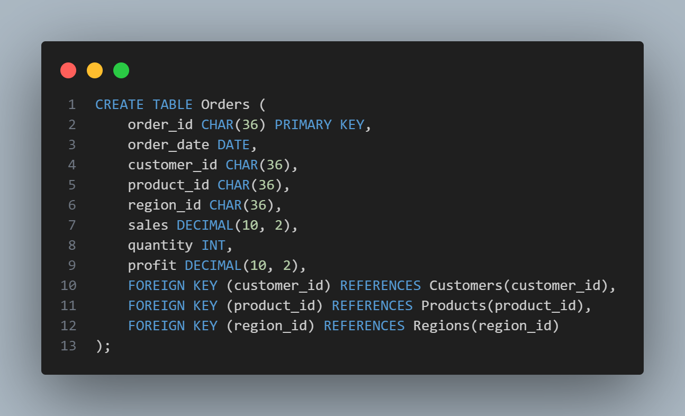
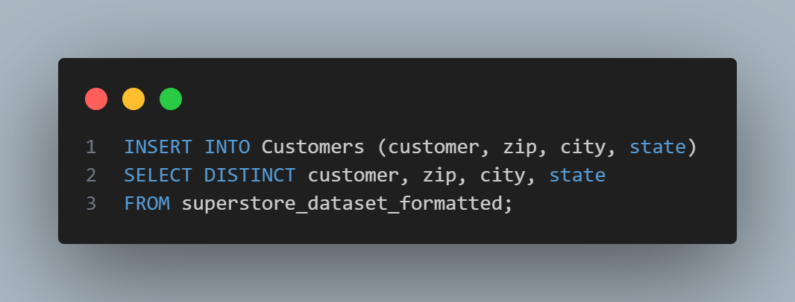
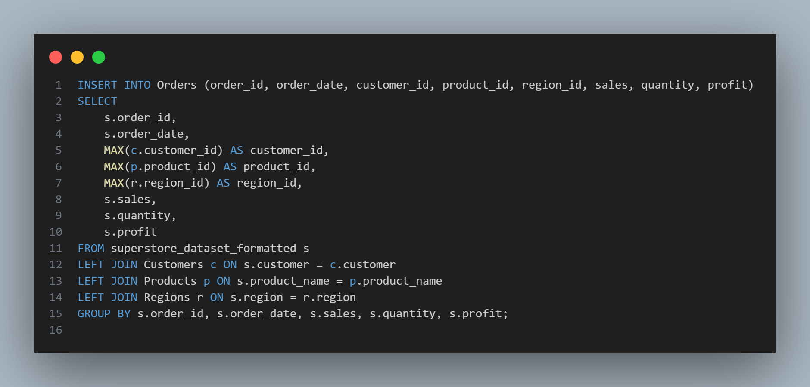

# Superstore Database Normalization

## Project Description

The goal of this project is to create a simple database normalization process. This process reduces redundancy and ensures referential integrity in the database. 

## Dataset

In this case, I use the superstore dataset [text](Superstore_Dataset_Formatted.csv), which is widely known. This data is very helpful for us to learn how to analyze data (e.g., Data Visualization, Importing to SQL, Python, etc.). Thanks for providing this data.

## ER Diagram

I want to normalize the dataset like the ER Diagram below :

## Steps

### 1. Import data from CSV to SQL (use tools like dbeaver, MySQL workbench, etc)
### 2. Create table :

⭐ customer_id CHAR(36) PRIMARY KEY DEFAULT (UUID()): In this case, I use UUID() 36 characters for the PRIMARY KEY, except in the Orders table where I use the default PRIMARY KEY because it is already provided in the file. So, I'm not creating UUID() again.

As you can see in the code above, I added 3 FOREIGN KEYs to connect the Customers, Products, and Regions tables.
Note: You can see the complete code in the provided file.

### 3. Insert data from the existing dataset

#### Import data to customer table

#### Import data to the orders table

Note: You can see the complete code in the provided file.

## Conclusion
This project demonstrates the process of normalizing a database to reduce redundancy and ensure referential integrity. By using UUIDs as primary keys and appropriately setting foreign keys, we ensure that each record is uniquely identifiable and properly linked across the different tables. The steps provided guide you through importing data, creating tables, and ensuring data integrity. This normalization will help in efficient data management and querying for various data analysis tasks.

Thank you,
Stay Blessed :)

Contact : elfridhasman@gmail.com

