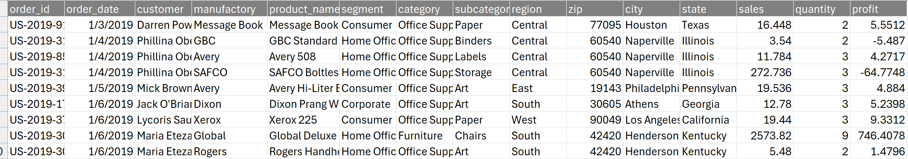

# Superstore Database Normalization

## Project Description

The goal of this project is to create a simple database normalization. This process is carried out to reduce redundancy and ensure referential integrity in the database. 

# Dataset

In this case, I use the superstore dataset [text](Superstore_Dataset_Formatted.csv), which is widely known. This data is very helpful for us to learn how to analyze data (e.g., Data Visualization, Importing to SQL, Python, etc.). Thanks for providing this data.

## ER Diagram

I want normalize the dataset like ER Diagram below :

## Steps

### 1. Import data from csv to SQL (use tools like dbeaver, mysql workbench, etc)
### 2. Create 5 table below :

CREATE TABLE Customers (
    customer_id CHAR(36) PRIMARY KEY DEFAULT (UUID()),
    customer VARCHAR(255),
    zip VARCHAR(10),
    city VARCHAR(255),
    state VARCHAR(255)
);

**customer_id CHAR(36) PRIMARY KEY DEFAULT (UUID())**
customer_id CHAR(36) PRIMARY KEY DEFAULT (UUID()): In this case, I use UUID() 36 characters for the PRIMARY KEY, except in the Orders table where I use the default PRIMARY KEY because it is already provided in the file. So, I'm not creating UUID() again.

CREATE TABLE Orders (
    order_id CHAR(36) PRIMARY KEY,
    order_date DATE,
    customer_id CHAR(36),
    product_id CHAR(36),
    region_id CHAR(36),
    sales DECIMAL(10, 2),
    quantity INT,
    profit DECIMAL(10, 2),
    FOREIGN KEY (customer_id) REFERENCES Customers(customer_id),
    FOREIGN KEY (product_id) REFERENCES Products(product_id),
    FOREIGN KEY (region_id) REFERENCES Regions(region_id)
);

You can see in the code above, I add 3 FOREIGN KEYs to connect the Customers, Products, and Regions tables.

### Insert data from already dataset

**Import data to customer table**

INSERT INTO Customers (customer, zip, city, state)
SELECT DISTINCT customer, zip, city, state
FROM superstore_dataset_formatted;

**Import data to orders table**
INSERT INTO Orders (order_id, order_date, customer_id, product_id, region_id, sales, quantity, profit)
SELECT 
    s.order_id,
    s.order_date,
    MAX(c.customer_id) AS customer_id,
    MAX(p.product_id) AS product_id,
    MAX(r.region_id) AS region_id,
    s.sales,
    s.quantity,
    s.profit
FROM superstore_dataset_formatted s
LEFT JOIN Customers c ON s.customer = c.customer
LEFT JOIN Products p ON s.product_name = p.product_name
LEFT JOIN Regions r ON s.region = r.region
GROUP BY s.order_id, s.order_date, s.sales, s.quantity, s.profit;

You can see the complete code in the file I have provided.

## Conclusion
This project demonstrates the process of normalizing a database to reduce redundancy and ensure referential integrity. By using UUIDs as primary keys and appropriately setting foreign keys, we ensure that each record is uniquely identifiable and properly linked across the different tables. The steps provided guide you through importing data, creating tables, and ensuring data integrity. This normalization will help in efficient data management and querying for various data analysis tasks.

Thank you.

License
This project is licensed under the MIT License - see the LICENSE file for details.

Thank you,
Stay Blessed :)

Contact : elfridhasman@gmail.com

